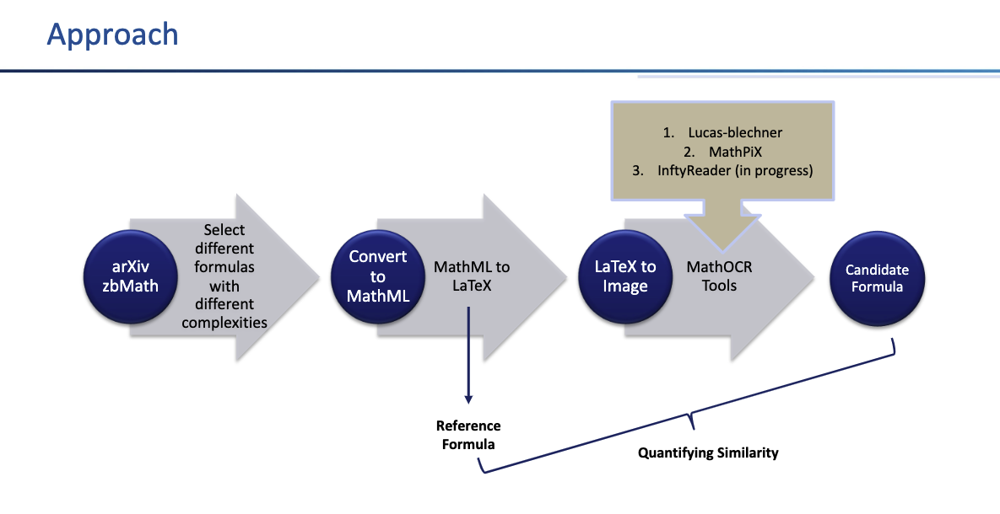

# MathOCR
Math Formula (MathML) Complexity Analyzer and LaTeX formula Comparison

# Math Formula (MathML) Complexity Analyzer and LaTeX formula Comparison

This GitHub repository provides an evaluation framework for extracting and converting formulas from various sources. The sources used in this project are zbMATH Open and arXiv, and the formulas are converted into LaTeX format using different tools: Inftyreader, MathPiX, and Lukas-blecher. The evaluation focuses on formulas of varying complexity, ranging from Complexity 1 to Complexity n. It also contains code for analyzing a MathML formula's (complexity) depth and length represented as a tree structure. The code for _analysing complexity_ is based on the research paper titled [Discovering Mathematical Objects of Interest - A Study of Mathematical Notations](https://arxiv.org/pdf/2002.02712.pdf) by [A. Greiner-Petter, M. Schubotz, F. Müller, C. Breitinger, H. S. Cohl, A. Aizawa, and B. Gipp].

## Features

- Calculates the depth and length of a MathML formula tree.
- Formula Extraction from zbMATH Open and arXiv repositories.
- Supports MathML formulas with various levels of complexity.
- Comparison of two LaTeX Math Formulas using BLEU score.
- Provides a command-line interface and jupyter notebook (with examples) for easy usage.

## To Do
1. Test InftyReader MathOCR tool for evaluation.
2. Keep account for structural arrangement.

## Prerequisites

To run the code in this repository, you need to have the following installed:

1. Python (version 3)
2. Matplotlib
3. Sympy
4. Pillow

## Usage
1. Clone this repository to your local machine:

   ```shell
   git clone https://github.com/mrsingh007143/MathOCR.git
   ```

2. Navigate to the project directory:

   ```shell
   cd MathOCR
   ```

3. For quick testing, see the `Jupyter notebooks`.


## Task 1 - The Complexity of Math formula - Depth and Length Calculation

The provided code calculates the complexity of a MathML formula by measuring the depth and length of its tree (XML) structure.

- **Depth**: Represents the maximum level of nesting within the formula.
- **Length**: Represents the number of `<mi>` nodes or elements present in the formula's XML structure.

Understanding the depth and length can be crucial for analyzing and comparing formulas, as well as assessing computational requirements.

### 1.1 To analyze a MathML string directly from the command line:

- For depth:

```shell
python Complexity_of_Math.py "<math><mrow><msubsup><mi>P</mi><mi>n</mi><mrow><mo>(</mo><mi>α</mi><mo>,</mo><mi>β</mi><mo>)</mo><mo></mo></mrow></msubsup><mo></mo><mrow><mo>(</mo><mi>x</mi><mo>)</mo></mrow></mrow></math>" --depth
```

- For length:
```shell
python Complexity_of_Math.py "<math><mrow><msubsup><mi>P</mi><mi>n</mi><mrow><mo>(</mo><mi>α</mi><mo>,</mo><mi>β</mi><mo>)</mo><mo></mo></mrow></msubsup><mo></mo><mrow><mo>(</mo><mi>x</mi><mo>)</mo></mrow></mrow></math>" --length
```
- For both:
```shell
python Complexity_of_Math.py "<math><mrow><msubsup><mi>P</mi><mi>n</mi><mrow><mo>(</mo><mi>α</mi><mo>,</mo><mi>β</mi><mo>)</mo><mo></mo></mrow></msubsup><mo></mo><mrow><mo>(</mo><mi>x</mi><mo>)</mo></mrow></mrow></math>" --both
```

* Replace `<math>...</math>` with your actual MathML string.

### 1.2 To analyze MathML from a file:

Place all your `<math>...</math>` blocks in a `.txt` file. Each block should start with `<math>` and end with `</math>`. For a reference see `sample_mathml.txt` file.

- For depth:

```shell
python Complexity_of_Math.py --file your_file.txt  --depth
```

* You can replace `--depth` to `--length` or `--both` accordingly.

## Task 2 - Comparision of Math Formulae in LaTeX
Comparing two Math formulas in LaTeX is helpful in verifying equivalence, detecting errors, identifying patterns, enhancing education, and improving mathematical communication.

### General Approach




### Steps:

### 1. Formula Sources

The zbMATH Open repository and the arXiv platform (accessible from Andre's repository) are used as sources of formulas for this evaluation. The formulas are selected based on their complexity level, with 10 candidates for each complexity level.

### 2. Convert to MathML

[FormulaCloudData](https://github.com/gipplab/FormulaCloudData) repository: Used for converting these formulas to MathML. 

### 3. MathML to LaTeX

Used online available tools (for example - https://www.npmjs.com/package/mathml-to-latex) to convert MathML into LaTeX. The output LaTeX form is our _Reference Formula_.

### 4. Rendering LaTeX formulae as Images

Python libraries (Matplotlib or sympy): Used for rendering LaTeX formulas as images. You can use `latex_to_image.ipynb` notebook under notebooks directory.

### 5. Formula Conversion Tools

Three different tools are utilized for converting PDFs/images containing formulas into LaTeX format:

1. [MathPiX](https://mathpix.com): A tool for converting images containing mathematical content into LaTeX equations.
2. [Lukas-blecher](https://github.com/lukas-blecher/LaTeX-OCR): A formula extraction and conversion tool that supports LaTeX output. See the usage under `notebook` directory.
3. [Inftyreader](https://www.sciaccess.net/en/InftyReader/): This tool converts scanned images and PDFs into LaTeX. `Update Soon`

### 6. Calculating the BLEU score

Calculated the similarity between Reference formula and Candidate formula using BLEU score. 
- You can find the code to calculate the BLEU score for arXiV and zbMath under `bleu_arxiv.ipynb` and `bleu_zbmath.ipynb` files resp.

### Bonus

After downloading the arXiV and zbMath data from Andre's repo (https://github.com/ag-gipp/FormulaCloudData). You can unzip and explore the data as mentioned on his repo.
Also, you can command line:
- To find the highest complexity - `grep -E "\".*\";([0-9]+);" arxiv_data/1 | sort -t ";" -k2 -rn | head -n 1`

- To find a specific complexity - `grep -E '^[^;]*;2;' arxiv_data/1`

`arxiv_data/1` is where arXiV data is stored. You can use same command line for `zbMath_data`.

## Contributing

Contributions to this project are welcome! If you encounter any issues or have suggestions for improvements, please submit a pull request or open an issue on the repository.

## Acknowledgments

The implementation of the Complexity of Math Formulas is based on the research paper "Discovering Mathematical Objects of Interest - A Study of Mathematical Notations" by A. Greiner-Petter, M. Schubotz, F. Müller, C. Breitinger, H. S. Cohl, A. Aizawa, and B. Gipp. We acknowledge their contributions to the field of mathematical notation analysis. We developed the entire codebase and implemented the algorithm for comparing math formulas.

## Citation

```shell
@InProceedings{GreinerPetter2020,
  author    = {Andr{\'{e}} Greiner{-}Petter and
               Moritz Schubotz and
               Fabian M\"{u}ller and
               Corinna Breitinger and
               Howard S.~Cohl and
               Akiko Aizawa and
               Bela Gipp},
  title     = {Discovering Mathematical Objects of Interest - A Study of Mathematical Notations},
  booktitle = {Proceedings of The Web Conference 2020 (WWW '20), April 20--24, 2020, Taipei, Taiwan},
  doi       = {10.1145/3366423.3380218}
}
```
